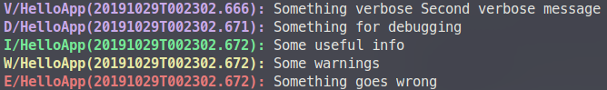

# Logger

A console.log() wrapper that logs more information.

## Installation

```bash
npm install @dnpr/logger
```

## Usage

Create an instance.

```javascript
const { Logger } = require('@dnpr/logger')

const log = new Logger('HelloApp', {
  logLevel: 'verbose',
  useColor: true 
})
```

Log messages with different levels.

```javascript
log.verbose('Something verbose', 'Second verbose message')
log.debug('Something for debugging')
log.info('Some useful info')
log.warn('Some warnings')
log.error('Something goes wrong')
```

Result :



## Ideas

* Log to other target than `stdout`. For example, `stderr`, file, remote address or URL.

* Log JSON formatted objects instead of strings.

* Let the user setup callback for each log level, so they can do some custom handling stuff.

* Customize log header format with a format string.

## Fun Facts

* I make it look like [Android Logcat](https://developer.android.com/studio/command-line/logcat).